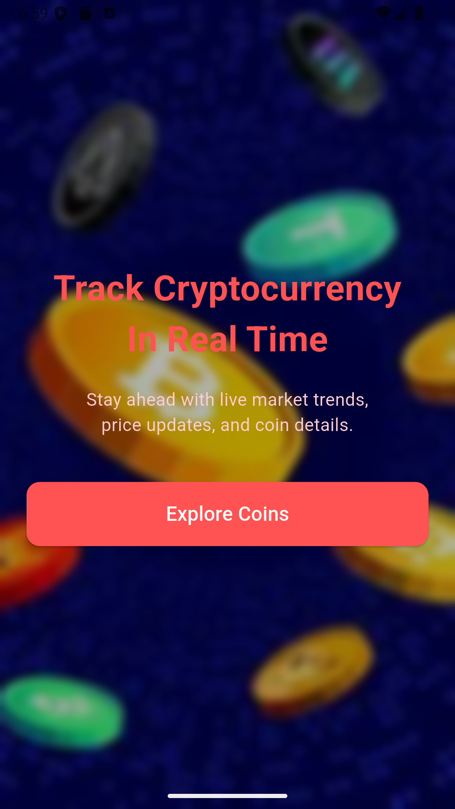
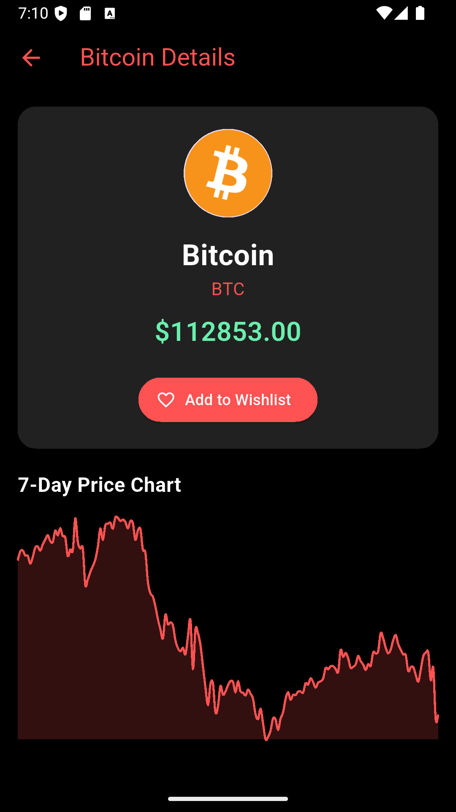
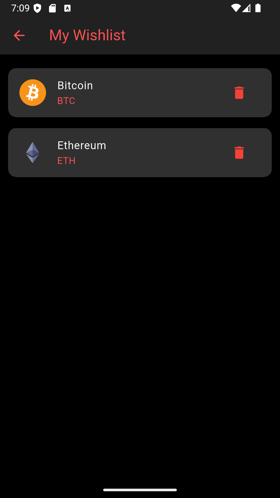

# 💰 Crypto Currency App

A beautiful and modern **Flutter application** that displays real-time cryptocurrency prices, lets users view detailed charts, and manage a personalized **wishlist** using local storage. Built with a focus on clean UI, responsiveness, and performance.

---


## ⚙️ Tech Stack

### 🚀 **Frontend:**
- **Flutter** — Cross-platform UI framework by Google
- **Dart** — Programming language for Flutter
- **Shared Preferences** — Local storage for wishlist
- **HTTP** — API requests (to fetch real-time crypto data)
- **Flutter Charts / fl_chart** — To display price graphs

### 🧠 State Management:
- ✅ Using basic `setState()` for small state updates
- ✅ `SharedPreferences` for persistent wishlist storage  

---

## 🧩 Features

- 🔍 **Real-Time Crypto Prices**
- 📊 **Interactive Detail Screen** with chart and description
- 💙 **Wishlist Management** with local storage
- 🧭 Smooth Navigation with `Navigator`
- 🌐 API integration (like [CoinGecko](https://www.coingecko.com/en/api))
- 🔎 **Search Functionality**
- 🖼️ Beautiful UI 
---
## 📱 App Preview

<div style="display: flex; flex-wrap: wrap; gap: 10px;">
  
  
  
  
</div>
---

## 🚀 Getting Started

### 🔧 Prerequisites

- Flutter SDK (3.x recommended)
- Dart SDK
- Android Studio / VS Code

### 🛠️ Installation

```bash
git clone https://github.com/yourusername/crypto_flutter_app.git
cd crypto_flutter_app
flutter pub get
flutter run
